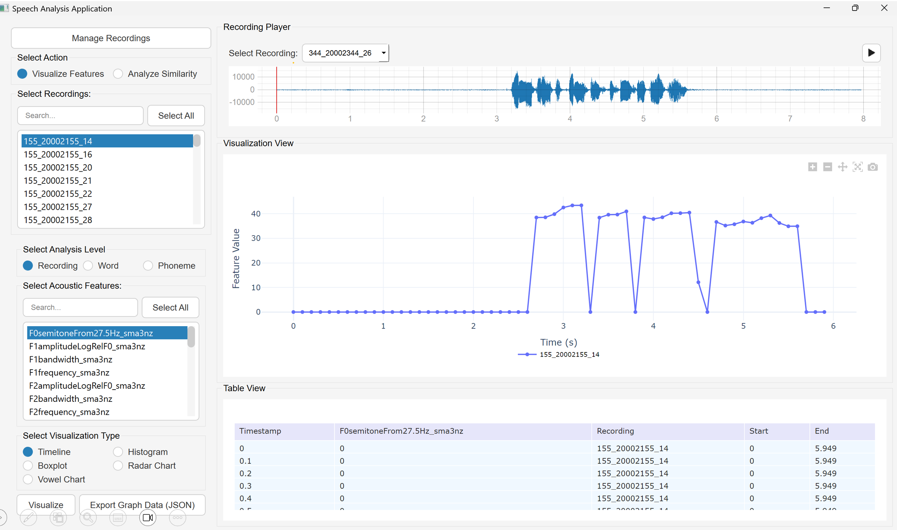
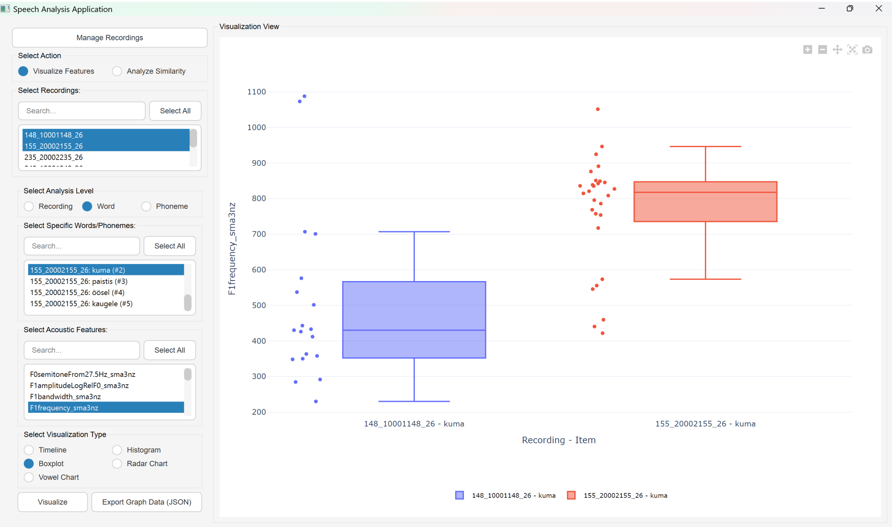
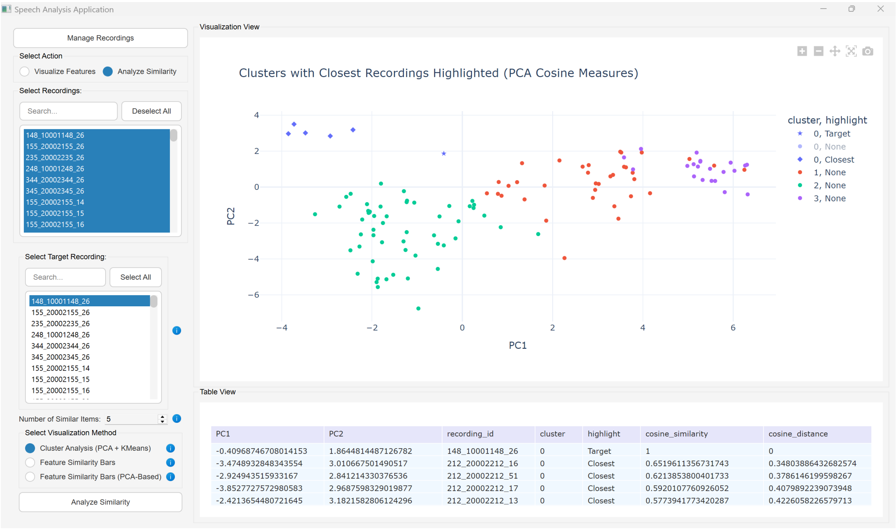

# Hääle akustiliste tunnuste visualiseerimise rakendus

Töölauarakendus GeMAPS akustiliste tunnuste analüüsiks foneetilistes uuringutes.

Rakendus võimaldab:
- Helifailidest OpenSMILE abil GeMAPS v02 LLD tunnustekomplekti eraldamist  
- Akustiliste tunnuste visualiseerimist erinevatel diagrammitüüpidel (joondiagramm, histogramm, karpdiagramm, radardiagramm ja vokaalikaart)  
- Helifailide sarnasuse analüüsi, kasutades scikit-learn K-means algoritmi, põhikomponentide analüüsi (PCA) ning koosinussarnasust  
- Praat TextGrid formaadis märgendfailide kasutamist, et võimaldada salvestuse, sõna ja foneemi tasemel analüüsi  

------------------------------------------------------------------------------

# Voice Acoustic Feature Visualization Tool

## Overview

A desktop application for analyzing acoustic features using the OpenSMILE GeMAPS ([Geneva Minimalistic Acoustic Parameter Set](https://ieeexplore.ieee.org/document/7160715?arnumber=7160715&filter%3DAND(p_IS_Number:5520654)=)).
## Features

- **GeMAPS Feature Extraction**  
  Extract GeMAPS v02 LLD features from audio files using [OpenSMILE](https://github.com/audeering/opensmile)

- **Interactive Visualization**  
  Plot extracted features in different chart types (timeline, histogram, box, radar, and vowel map) with [Plotly](https://github.com/plotly/plotly.py)

- **Similarity Analysis using [scikit-learn](https://github.com/scikit-learn/scikit-learn)**  
  - K-means clustering  
  - Principal Component Analysis
  - Cosine similarity  

- **TextGrids**  
  - Use [Praat TextGrids](https://www.fon.hum.uva.nl/praat/manual/TextGrid.html) data to visualize features at recording, word, or phoneme level

## Technologies

- **Frontend**: PyQt5
- **Data Visualization**: Plotly
- **Database**: MongoDB
- **Feature Extraction**: OpenSMILE
- **Similarity Analysis**: scikit-learn

## Installation

### Prerequisites

- Python 3.9 or higher  
- MongoDB (optional if using mock database)

### Setup

1. **Clone the repository**  

2. **Install dependencies**
   ```
   pip install --upgrade pip
   pip install -r requirements.txt
   ```

3. **Configure the database**
* Set up MongoDB if you want to use a real database.
* OR for testing you can use an in-memory mock database, set:
     ```
    USE_MONGO_MOCK = True
    ```
    in `config.py` (no MongoDB installation required).

4. **Run the application**
   ```
   python app.py
   ```
### Screenshots




